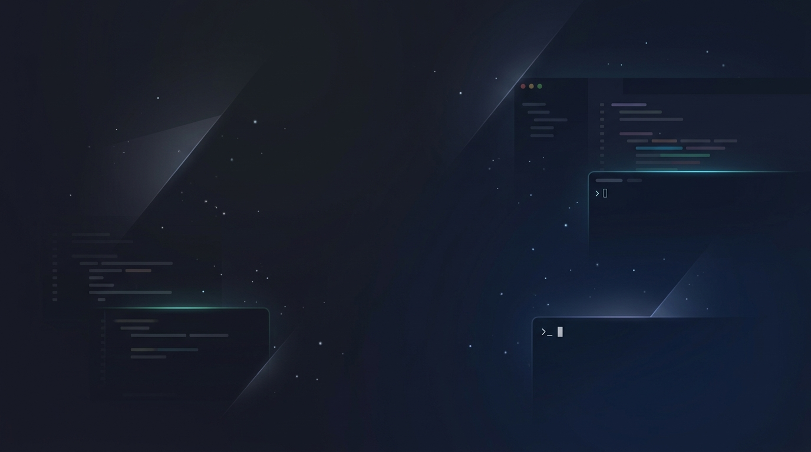

<div align="center">
  <br>
  
  <br>
  <br>
  

  <h1>Gemini Desktop</h1>

  <p><strong>A native, lightning-fast desktop client for Google Gemini — built with Rust & Tauri.</strong></p>

  <p>
    <a href="https://github.com/Omux25/gemini-desktop/releases/latest">
      
    </a>
    &nbsp;
    <a href="https://github.com/Omux25/gemini-desktop/releases/latest">
      
    </a>
    &nbsp;
    
  </p>

  <p>
    <a href="https://github.com/Omux25/gemini-desktop/releases/latest">
      
    </a>
    &nbsp;
    
    &nbsp;
    
    &nbsp;
    
    &nbsp;
    
  </p>
</div>

<br>

> **Gemini Desktop** takes Google Gemini out of your browser tabs and turns it into an always-available, system-wide native desktop assistant. Summon it instantly with a hotkey, inject selected text or screenshots directly into your prompt, and dismiss it just as fast — all from a lightweight Rust backend that idles at near-zero RAM.

---

## ⚡ Highlights

<table>
  <tr>
    <td width="50%">
      <h3>🎯 Instant Access</h3>
      <p>Summon Gemini from anywhere with a global hotkey. No browser tab hunting. No context switching. Just press <kbd>Alt</kbd> + <kbd>Space</kbd> and start typing.</p>
    </td>
    <td width="50%">
      <h3>📋 Smart Text Selection</h3>
      <p>Highlight any text on your screen, press <kbd>Alt</kbd> + <kbd>C</kbd>, and it gets injected directly into Gemini's prompt — ready for analysis, translation, or explanation.</p>
    </td>
  </tr>
  <tr>
    <td width="50%">
      <h3>✂️ Native Snipping Tool</h3>
      <p>Press <kbd>Alt</kbd> + <kbd>S</kbd> to capture any region of your screen. The screenshot is automatically converted to Base64 and injected into Gemini's prompt input.</p>
    </td>
    <td width="50%">
      <h3>📌 Always on Top</h3>
      <p>Pin Gemini above all other windows. Perfect for referencing answers while coding, gaming, or taking notes. Toggle with a single click.</p>
    </td>
  </tr>
  <tr>
    <td width="50%">
      <h3>🪶 Lightweight Native Process</h3>
      <p>The Rust backend idles at ~1 MB. Smooth Mode injects low-end Webview2 flags and flushes the working set via native OS calls to keep the overall footprint minimal.</p>
    </td>
    <td width="50%">
      <h3>🔄 Silent Auto-Updater</h3>
      <p>Seamless in-app updates with a progress bar. No manual downloads. Works identically for both the installer and portable editions.</p>
    </td>
  </tr>
</table>

---

## ⌨️ Keyboard Shortcuts

| Shortcut | Action | Customizable |
|----------|--------|:------------:|
| <kbd>Alt</kbd> + <kbd>Space</kbd> | Toggle Gemini window | ✅ |
| <kbd>Alt</kbd> + <kbd>C</kbd> | Smart Text Selection — grab highlighted text into Gemini | ✅ |
| <kbd>Alt</kbd> + <kbd>S</kbd> | Snip & Send — capture screen region into Gemini | ✅ |
| <kbd>Ctrl</kbd> + <kbd>,</kbd> | Open Settings | — |
| <kbd>Alt</kbd> + <kbd>←</kbd> | Navigate back inside Gemini | — |

---

## 📥 Download & Install

<table>
  <tr>
    <td align="center" width="50%">
      <h3>🖥️ Standard Installer</h3>
      <p>Installs to Program Files with auto-start support and system tray integration.</p>
      <a href="https://github.com/Omux25/gemini-desktop/releases/latest">
        
      </a>
    </td>
    <td align="center" width="50%">
      <h3>📦 Portable Edition</h3>
      <p>Single executable. No installation required. Run from anywhere — USB, Desktop, or network drive.</p>
      <a href="https://github.com/Omux25/gemini-desktop/releases/latest">
        
      </a>
    </td>
  </tr>
</table>

> [!NOTE]
> **Windows SmartScreen:** As an indie open-source project without an EV Code Signing certificate, Microsoft Defender SmartScreen may flag the executable on first run. Click **"More Info → Run anyway"** to proceed.

---

## 🏗️ Architecture

This application enforces a **strict separation of concerns** with zero escape hatches:

```
┌─────────────────────────────────────────────────────────┐
│  Frontend (Svelte 5 + TypeScript)                       │
│  ├── settingsService.ts    — Settings IPC layer         │
│  ├── windowService.ts      — Window IPC layer           │
│  ├── updaterService.ts     — Auto-updater IPC layer     │
│  └── store.ts              — Reactive state (Svelte 5)  │
├─────────────────────────────────────────────────────────┤
│  Backend (Rust + Tauri v2)                              │
│  ├── ipc::window           — Hotkeys, focus, injection  │
│  ├── ipc::settings         — Persistence & config       │
│  ├── ipc::system           — Lifecycle & restart        │
│  ├── updater               — Portable update engine     │
│  └── config                — Chromium flags & paths     │
└─────────────────────────────────────────────────────────┘
```

**Engineering standards enforced across the codebase:**
- Zero `any` or `@ts-ignore` bypasses — strict TypeScript with `noUnusedLocals` and `noUnusedParameters`
- Zero inline JavaScript in Rust — all scripts extracted to `scripts/*.js` and loaded via `include_str!()`
- Zero interval polling loops in the DOM — `MutationObserver` for all webview state detection
- All dynamic webview parameters serialized via `serde_json::to_string()` to prevent injection

---

## 🛠️ Building from Source

**Prerequisites:** [Node.js](https://nodejs.org/) (v18+) and [Rust](https://www.rust-lang.org/) (stable)

```bash
# Clone the repository
git clone https://github.com/Omux25/gemini-desktop.git
cd gemini-desktop

# Install dependencies
npm install

# Run in development mode
npm run tauri dev

# Build for production
npm run tauri build
```

---

## 📜 License

This project is licensed under the **[PolyForm Noncommercial License 1.0.0](LICENSE)**.

You are free to use, modify, distribute, and build upon this code for **non-commercial purposes only**.
